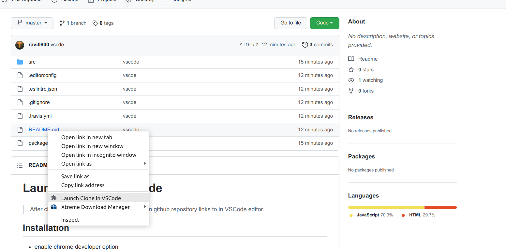

# Launch Clone in VSCode

>After cloning a repo in local machinee, easily open file or folder from github repository links to in VSCode editor for quick access.

## Installation

- enable chrome developer option
- load the extension by selecting src 
- set the path of you project in option menu of extention 

## Usage

- working in gitub and gitlab
- might work in other site too

